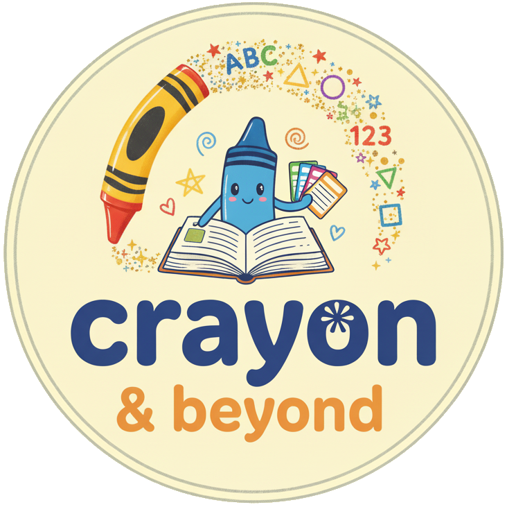

# Crayon & Beyond 🎨

A beautiful, responsive portfolio website showcasing educational activity books and materials for children. Built with vanilla HTML, CSS, and JavaScript.



## 🌟 Features

- **Responsive Design**: Fully optimized for desktop, tablet, and mobile devices
- **Bilingual Support**: English and Romanian language switching
- **Interactive Project Previews**: Click on any project card to view detailed information
- **Smooth Animations**: Intersection Observer API for scroll-triggered animations
- **Mobile-First Navigation**: Burger menu for mobile devices
- **Modern UI/UX**: Clean, colorful design with gradient backgrounds
- **Performance Optimized**: Fast loading times and smooth interactions

## 📁 Project Structure

```
crayonandbeyond.github.io/
├── index.html          # Main HTML file
├── styles.css          # All styling
├── script.js           # JavaScript functionality
├── README.md           # This file
└── img/                # Images folder
    ├── favicon.ico
    ├── round-logo.png
    ├── alphabet-cover.jpg
    ├── alphabet-1.jpg
    ├── alphabet-2.jpg
    ├── numbers-cover.jpg
    ├── numbers-1.jpg
    ├── numbers-2.jpg
    ├── roadFun-cover.jpg
    ├── roadFun-1.jpg
    ├── roadFun-2.jpg
    ├── backpackFun-cover.jpg
    ├── backpackFun-1.jpg
    ├── backpackFun-2.jpg
    ├── routine-cover.jpg
    ├── routine-1.jpg
    └── routine-2.jpg
```

## 🚀 Getting Started

### Prerequisites

- A modern web browser (Chrome, Firefox, Safari, Edge)
- Basic understanding of HTML, CSS, and JavaScript (for modifications)

### Installation

1. Clone the repository:
```bash
git clone https://github.com/CrayonAndBeyond/crayonandbeyond.github.io.git
```

2. Navigate to the project directory:
```bash
cd crayonandbeyond.github.io
```

3. Open `index.html` in your browser or use a local server:
```bash
# Using Python 3
python -m http.server 8000

# Using Node.js (with http-server)
npx http-server
```

4. Visit `http://localhost:8000` in your browser

## 🎨 Customization

### Adding a New Project

1. Open `script.js`
2. Find the `translations` object
3. Add your project to both `en` and `ro` sections:

```javascript
{
  id: 'your-project-id',
  title: 'Your Project Title',
  description: 'Brief description...',
  cover: 'img/your-cover.jpg',
  previewTitle: 'Your Project - Preview',
  images: ['img/your-img-1.jpg', 'img/your-img-2.jpg'],
  previewDescription: `
    <p>Detailed description...</p>
    <ul>
      <li>Feature 1</li>
      <li>Feature 2</li>
    </ul>
  `
}
```

### Changing Colors

The main color scheme uses CSS variables. Key colors are defined in `styles.css`:

- Primary Blue: `#3b82f6`
- Purple Accent: `#8b5cf6`
- Text Colors: `#334155`, `#475569`, `#64748b`
- Backgrounds: Various gradients

### Modifying Translations

All text translations are in `script.js` under the `translations` object. Update both `en` and `ro` sections to add or modify text.

## 📱 Browser Support

- ✅ Chrome (latest)
- ✅ Firefox (latest)
- ✅ Safari (latest)
- ✅ Edge (latest)
- ✅ Mobile browsers (iOS Safari, Chrome Mobile)

## 🐛 Bug Fixes (v2.0)

This version includes fixes for:

- ✅ Logo cropping on mobile devices
- ✅ Missing navigation menu on mobile (added burger menu)
- ✅ Improved responsive design across all screen sizes
- ✅ Removed dotted borders from images
- ✅ Better preview layout on desktop
- ✅ Clickable project cards

## 🌍 Language Support

The website supports two languages:
- 🇬🇧 English (EN)
- 🇷🇴 Romanian (RO)

Users can switch between languages using the language switcher in the navigation bar.

## 📊 Sections

1. **Home (Hero)**: Eye-catching introduction with animated logo
2. **About**: Information about Cassandra and the mission
3. **Projects**: Portfolio of activity books with detailed previews
4. **Pricing**: Transparent pricing for all products
5. **Contact**: Easy ways to get in touch

## 🔧 Technical Stack

- **HTML5**: Semantic markup
- **CSS3**: Modern styling with Grid and Flexbox
- **JavaScript (ES6+)**: Vanilla JS, no frameworks
- **GitHub Pages**: Free hosting

## 📈 Performance

- Optimized images
- Minimal JavaScript
- No external dependencies
- Fast load times (<2s on 3G)

## 🤝 Contributing

Contributions, issues, and feature requests are welcome!

1. Fork the project
2. Create your feature branch (`git checkout -b feature/AmazingFeature`)
3. Commit your changes (`git commit -m 'Add some AmazingFeature'`)
4. Push to the branch (`git push origin feature/AmazingFeature`)
5. Open a Pull Request

## 📝 To-Do List

- [ ] Add shopping cart functionality
- [ ] Integrate payment gateway
- [ ] Implement contact form backend
- [ ] Add more animation effects
- [ ] Create downloadable sample PDFs

## 📧 Contact

**Crayon & Beyond**
- Email: crayonbeyond@gmail.com
- Website: [https://crayonandbeyond.github.io](https://crayonandbeyond.github.io)

---

**Made with ❤️ for children's education**